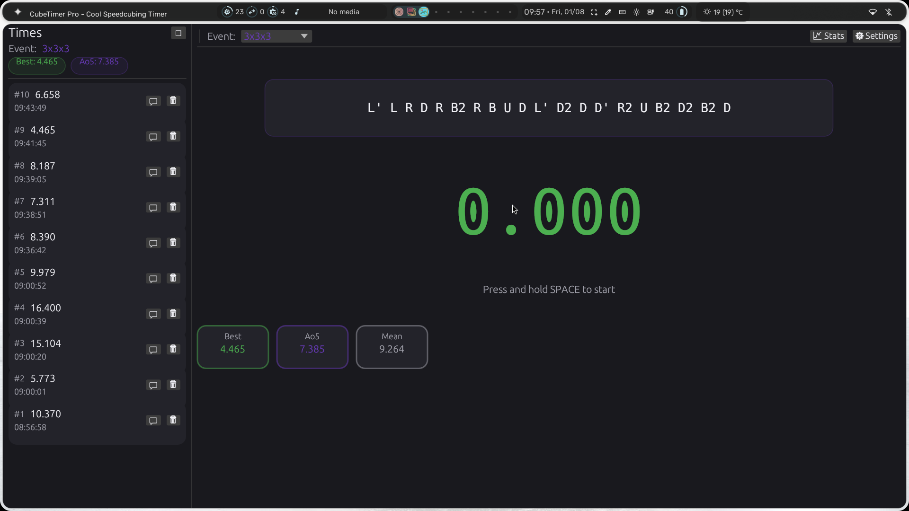
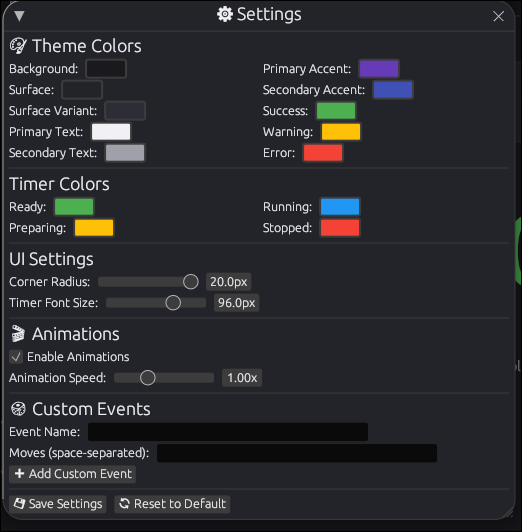
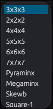
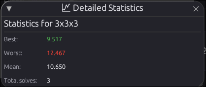

# **LSTimer-Linux**

A **minimal**, **accurate**, and **blazingly fast** Rubik's Cube timer for Linux — built with Rust.



---

## 🚀 Features

- ✅ WCA-style inspection and timing
- 🎯 Scramble generator per event
- 📊 Session stats
- 🔗 Bluetooth timer support ***(coming soon)***
- ⚡ Lightweight & terminal-based
- 🧠 Clean and intuitive UI

---

## 🖼️ Screenshots

### 🔧 Settings Panel


### 🧩 Multiple Events


### 📈 Detailed Stats


---

## 🛠️ Requirements

- 🐧 Linux (tested on Arch Linux + Wayland: Hyprland, KDE Plasma 6)
- 🦀 Rust 1.87 or newer

---

## 📦 Installation

```bash
git clone https://github.com/Link-the-Coder/LSTimer-Linux.git
cd LSTimer-Linux
cargo run --release
```

    💡 Tip: For faster startup, run the built binary directly:
    ./target/release/LSTimer

🖥️ Create Desktop Shortcut (Optional)

    Open the desktop entry file:

nano ~/.local/share/applications/LSTimer.desktop

Paste the following (⚠️ replace /home/yourname with your username):
```INI
    [Desktop Entry]
    Name=LSTimer
    Comment=Launch LSTimer Rust App
    Exec=/home/yourname/LSTimer-Linux/target/release/LSTimer
    Terminal=false
    Type=Application
    Categories=Utility;
    StartupNotify=true
    Icon=/home/yourname/LSTimer-Linux/icon.png
```
    Save and close. It should now appear in your app launcher.

🧠 Usage
```
    Space: Start / Stop timer

    Wait for green light before releasing the spacebar

    Scramble auto-refreshes for every event

    Escape (Esc): Exit app safely

    ⚠️ Note: On exit, a message may say the app is unresponsive — just click Terminate.
```

🔒 License

All rights reserved.
Source code is viewable but modification, reuse, and redistribution are prohibited.

Made by Link-the-Coder
