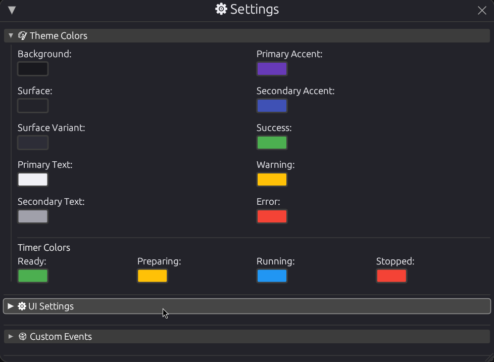

# **LSTimer**

A **minimal**, **accurate**, and **blazingly fast** Rubik’s Cube timer — built with Rust.

# Install guide
[Install guide](#-installation)


---

## 🚀 Features

* ✅ WCA-style inspection and timing
* 🎯 Scramble generator for multiple events
* 📊 Detailed session statistics
* 🔗 Bluetooth timer support **(coming soon)**
* ⚡ Lightweight, terminal-based with low resource usage
* 🧠 Clean, intuitive UI designed for speed and simplicity

---

## 🖼️ Screenshots

### 🔧 Settings Panel



### 🧩 Multiple Events


### 📈 Detailed Stats


---

## 🛠️ Requirements

* Git
* Any functioning OS
* Rust 1.87 or newer
* Cargo (Rust package manager)

---

## 📦 Installation

### Mac and linux:

Easy option: go to the [Releases](https://github.com/Link-the-Coder/LSTimer/releases) tab and install the executable file called LSTimer and run it

Or (more complex, only for linux):

**⚠️ Please install packages step-by-step with your correct package manager!**
If unsure, `apt` is likely your package manager (Debian/Ubuntu). Otherwise, search online.

```bash
# Install Git
sudo pacman -S git      # Arch Linux
sudo apt install git    # Debian/Ubuntu

# Clone the repository
git clone https://github.com/Link-the-Coder/LSTimer.git ~/LSTimer
cd LSTimer

# Install Cargo
sudo pacman -S cargo    # Arch Linux
sudo apt install cargo  # Debian/Ubuntu

# Run the app in release mode
cargo run --release
```

### Windows

Go to the [Releases](https://github.com/Link-the-Coder/LSTimer/releases) tab and install the LSTimer.exe and run it

💡 **Tip:** For faster startup, run the compiled binary directly:

```bash
./target/release/LSTimer
```

---

## 🖥️ Optional: Create Desktop Shortcut

Open or create the desktop entry file:

```bash
nano ~/.local/share/applications/LSTimer.desktop
```

Paste this (replace `/home/yourname` with your actual username):

```ini
[Desktop Entry]
Name=LSTimer
Comment=Launch LSTimer Rust App
Exec=/home/yourname/LSTimer/LSTimer
Terminal=false
Type=Application
Categories=Utility;
StartupNotify=true
Icon=/home/yourname/LSTimer/icon.png
```

Save and exit.
LSTimer should now appear in your app launcher.

---

## 🧠 Usage

* **Space**: Start / Stop timer
* Wait for green light before releasing Spacebar
* Scramble auto-refreshes for each event
* **Escape (Esc)**: Exit app safely
* ⚠️ On exit, if the app appears unresponsive, click **Terminate**

---

## 🔒 License

All rights reserved.
Source code is viewable but **modification, reuse, and redistribution are prohibited**.

---

Made by **Link-the-Coder**

---
